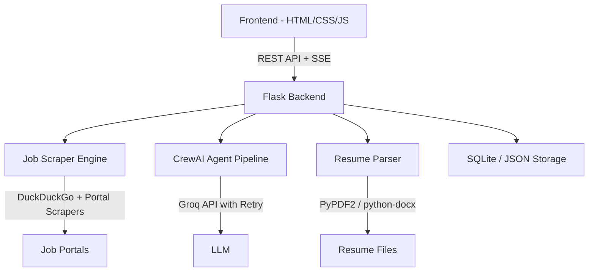

# 🎯 Job Hunter Agent — Full Polish Implementation Plan

## Architecture Overview

## Phase 1: Backend API (Flask)
Replace Streamlit with a proper Flask API server.

## Phase 2: Premium Frontend (HTML/CSS/JS)
Dark theme with glassmorphism, drag-and-drop resume upload, date picker, portal selector.

## Phase 3: Enhanced Scraping
15-20 jobs from 7+ portals via DuckDuckGo proxy searches.

## Phase 4: Resume Upload
PDF and DOCX support.

## Phase 5: Smart Rate Limit Handling
Exponential backoff + batch processing + key rotation.

## Phase 6: Additional Features
Persistent storage, search history, export.

See full details in the artifacts folder.
